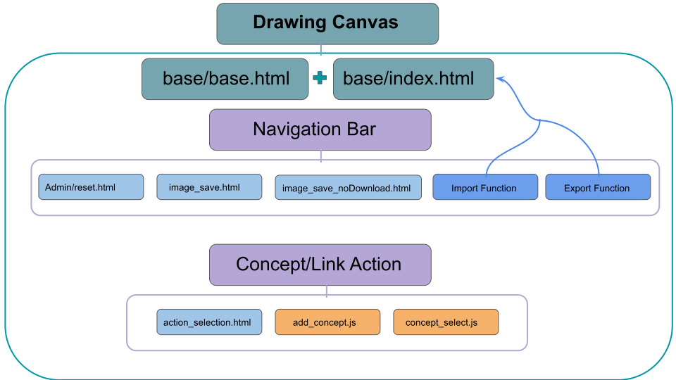
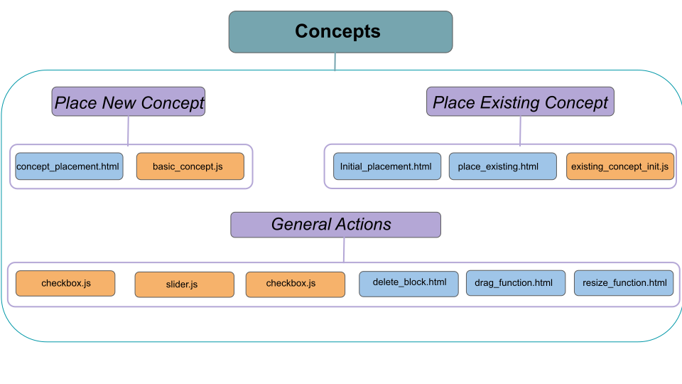

.. _frontend:

Frontend
========

This section of the documentation contains a description of the key templates and javascript files (mainly written in Jquery)
used to create the user interface, create CAMS, and allow the user to build their own CAMs.

Below is  a graphical depiction of the main functionalities broken down into
the following categories: Drawing Tool, Concepts, and Links.

Drawing Tools
^^^^^^^^^^^^^
The drawing tools section contains the primary files for running the primary drawing canvas.
The base files are the base.html and index.html files.

base/index.html
###############
This file is the basic wrapper for the entire CAM drawing page. It imports all the basic functionality from other files
with the exception of selecting concepts and links.

Concepts
^^^^^^^^
This section deals with the creation and handling of concepts.

Links
^^^^^
This section deals with the creation and handling of links.

.. image:: Images/Links.svg

dashboard.html
##############
This file defines the basics of the dashboard page -- this is the main administrative page for a researcher.
On this page, the researcher has the ability to start a new project, view current projects, start a new CAM, and delete projects and CAMs.
